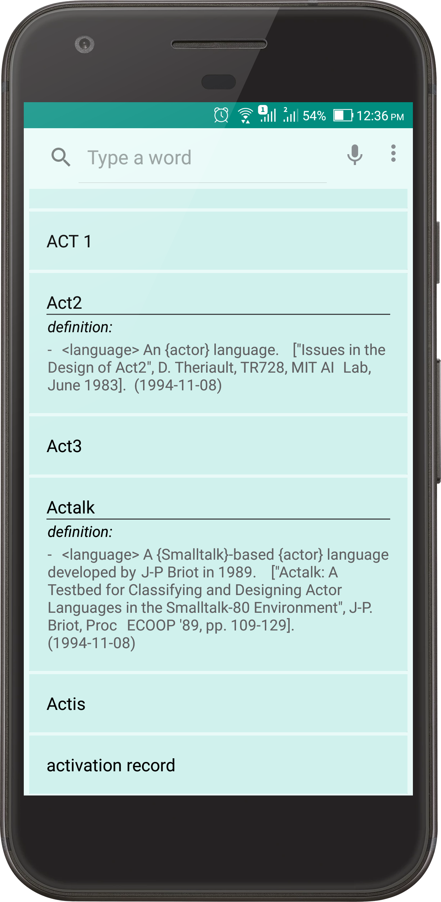
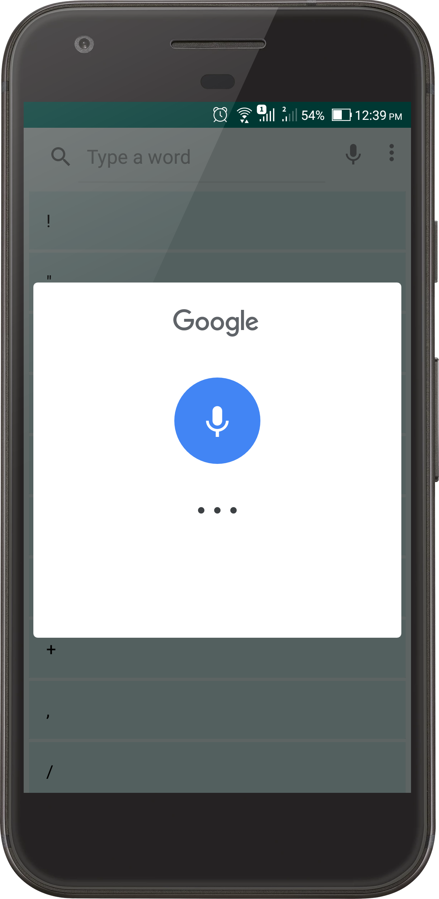
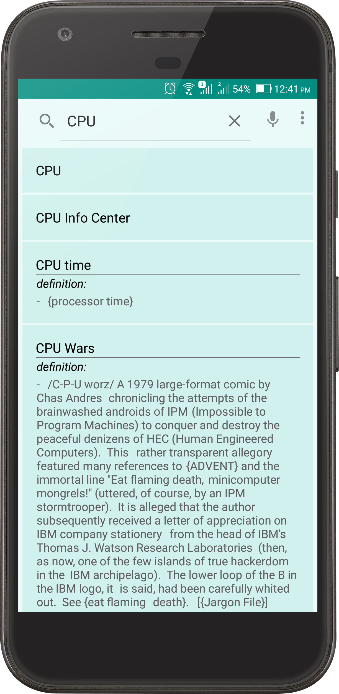

# *cs Dictionary*
> _computer science dictionary_

### features for user / learner-
* Word Searching
* Voice searching
* Large word collection
* Expandable view for word and definition
* Search history for auto suggestion

### features for developer-
* Using Kotlin Language
* SQLite Database
* RecyclerView
* Libraries- CardView, SweetToast (for custom toasting)

[Download APK](https://github.com/TheHasnatBD/csDictionary/blob/master/files/csDictionary.zip)
#### app screenshots

 Word with Definition                       | Voice Search                                | Search with autosuggestion 			                 
:------------------------------------------:|:-------------------------------------------:|:-----------------------------------------------:
  | |
 
 
 